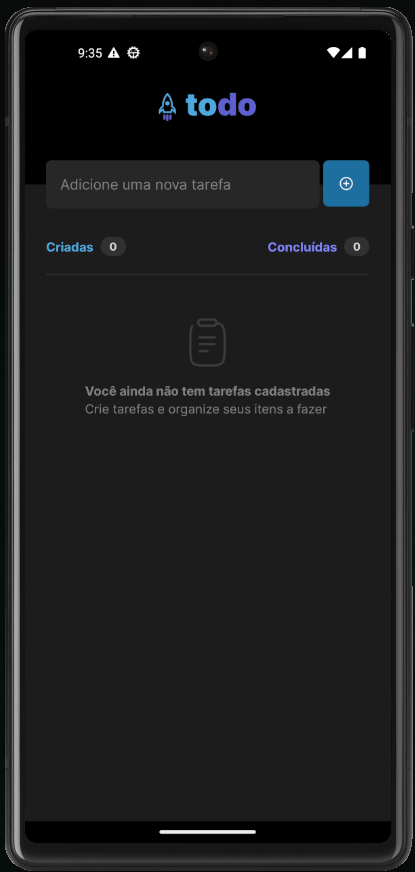

# Todo Mobile

The purpose of this app is to help people organize their daily tasks. This is an application where you can register, remove and mark tasks as completed.

<p align="center">
  
</p>

## Tech Stack

- [React Native](https://reactnative.dev/)
- [TypeScript](https://www.typescriptlang.org)
- [Expo](https://expo.io/)

## Installation

```
npm i
```

```
npx expo start
```
